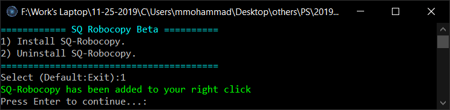
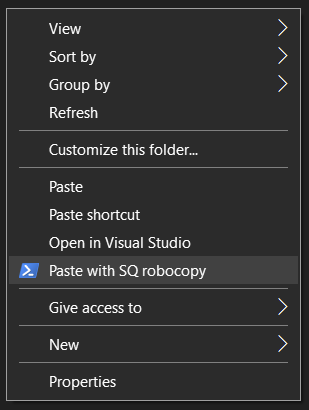
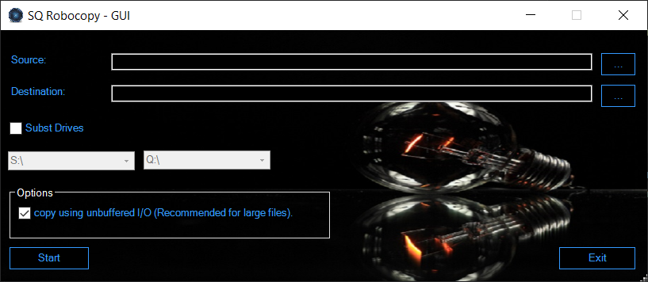

# SQ-Robocopy-Beta
This program based on robocopy "https://docs.microsoft.com/en-us/windows-server/administration/windows-commands/robocopy"
It's working to add a new item into right click menu, "Paste with SQ robocopy".
You can install and uninstall through "Install - Uninstall - SQ Robocopy",
The second program "SQ-Robocopy-GUI" help you to use robocopy with GUI. 

Notes:
  - Please keep the files in the same directory during installation.
  - It's treact cut option as copy.

Screenshots:
SQ-Robocopy Installation:

SQ-Robocopy-GUI

